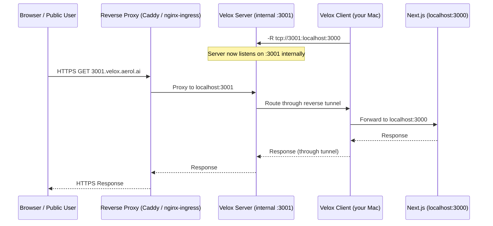
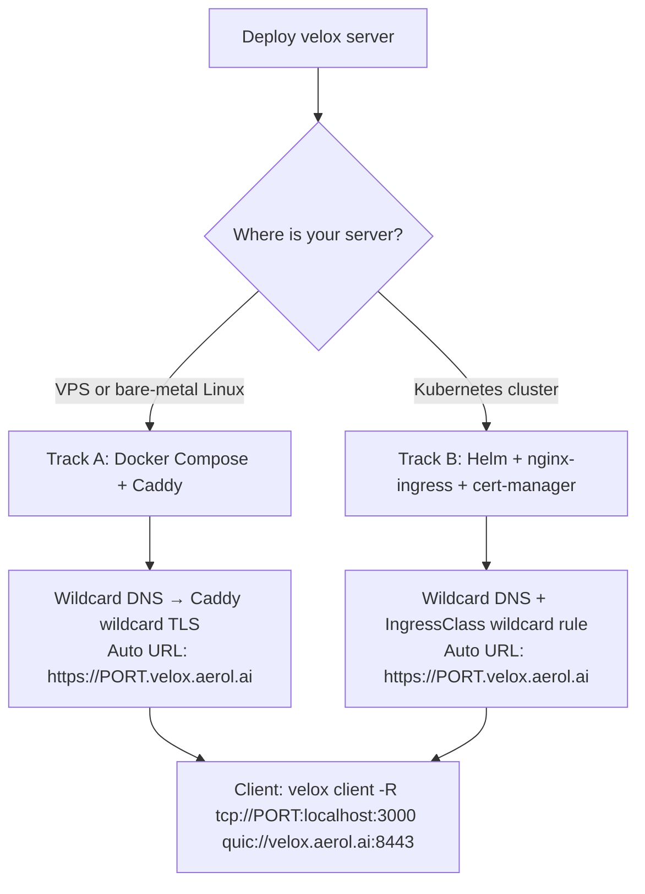
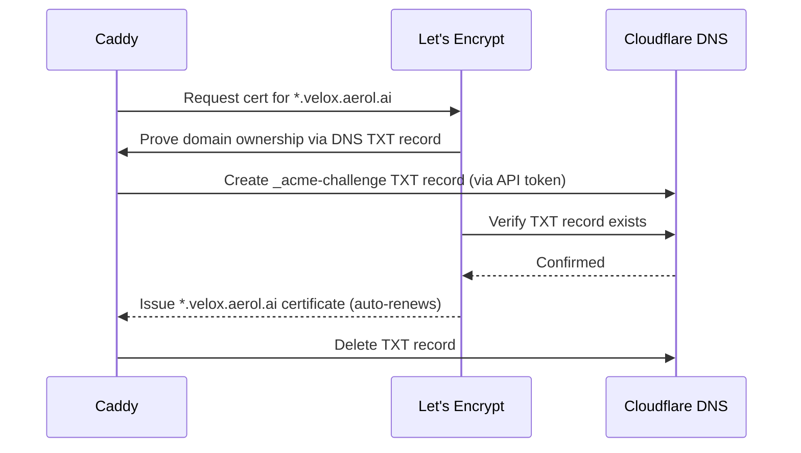
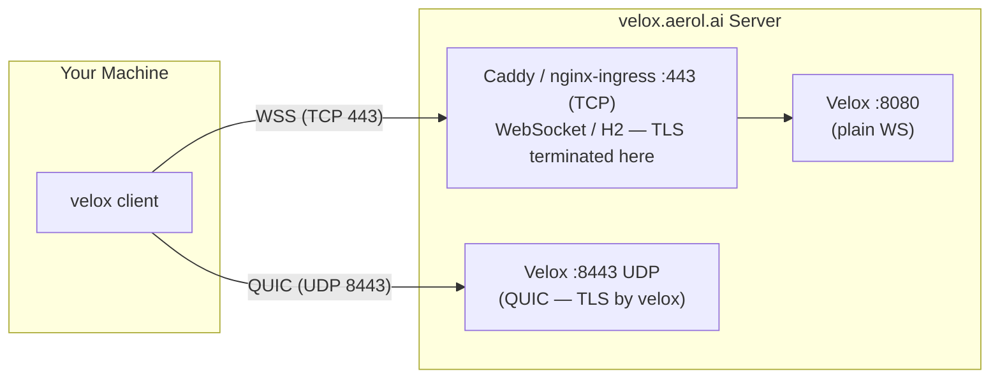
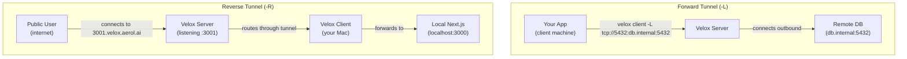
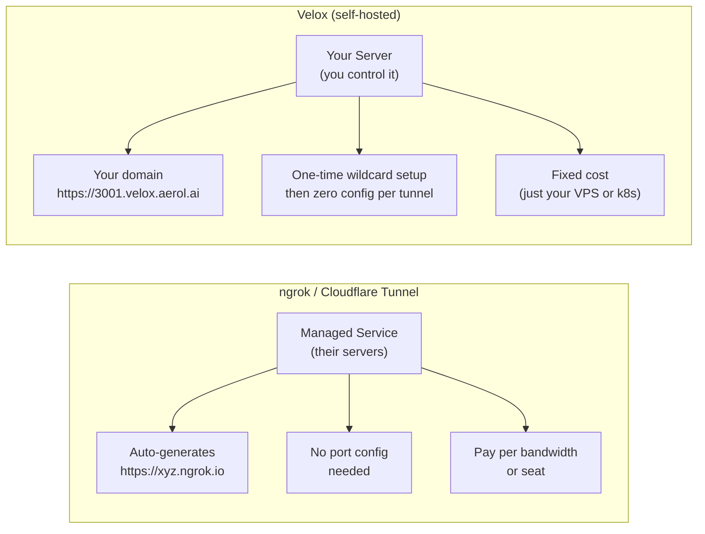
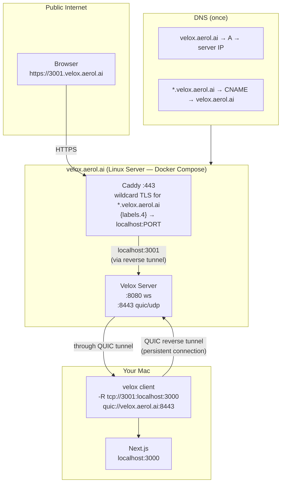

# How to Use the Velox Client

A practical, use-case-driven guide for exposing local services through your velox server — including Next.js apps, SSH, databases, WireGuard VPN, and more.

---

## Table of Contents

1. [What is Velox and How Does It Work?](#what-is-velox)
2. [How the Client-to-Public Flow Actually Works](#client-to-public-flow)
3. [Installing the Velox Client](#installing-the-client)
4. [Server Setup & DNS — Two Deployment Tracks](#server-setup)
   - 4a. [Docker Compose + Caddy (VPS / bare-metal)](#docker-caddy)
   - 4b. [Kubernetes / Helm (nginx-ingress + cert-manager)](#helm-k8s)
5. [Exposing a Local Next.js Server (Port 3000) to Public](#exposing-nextjs)
6. [Using QUIC Transport](#using-quic)
7. [Forward vs Reverse Tunnels — The Key Distinction](#forward-vs-reverse)
8. [40 Use Cases — Can Velox Solve It?](#40-use-cases)
9. [Velox vs Cloudflare Tunnel vs ngrok](#comparison)
10. [Quick Reference Cheatsheet](#cheatsheet)

---

## 1. What is Velox and How Does It Work? <a name="what-is-velox"></a>

Velox tunnels arbitrary TCP/UDP/Unix traffic over **WebSocket**, **HTTP/2**, or **QUIC**. It is a **self-hosted tunneling tool** — you own the server, you control the access rules.

**Velox is NOT a managed service like ngrok or Cloudflare Tunnel.** It is the infrastructure primitive they are built on. You bring your own server (or deploy with the provided Docker Compose / Helm charts), and you configure what gets exposed.

### The Two Tunnel Directions

| Flag | Direction | Use case |
|------|-----------|----------|
| `-L` | **Forward**: local port → remote host (via server) | Access a remote DB, SSH via a bastion |
| `-R` | **Reverse**: server port → your local service | Expose your local dev server to the internet |

To expose your local Next.js server to the public, you use `-R` (reverse tunnel).

---

## 2. How the Client-to-Public Flow Actually Works <a name="client-to-public-flow"></a>



**Architecture breakdown:**

```
Public Internet
    │
    ▼
velox.aerol.ai (your Linux server / Kubernetes cluster)
    │
    ├── Reverse Proxy :443 (TCP/WebSocket TLS)
    │     Docker Compose:  Caddy  → proxy to velox:8080
    │     Kubernetes:      nginx-ingress → velox ClusterIP:8080
    │
    ├── Velox Server :8080 (WebSocket/HTTP2, no TLS — proxy terminates)
    │
    └── Velox Server UDP :8443 (QUIC — velox handles TLS directly)
             ▲
             │  Reverse tunnel from your Mac
    Your Mac (velox client)
         └── localhost:3000  (Next.js)
```

**Key insight:** Velox creates a raw TCP/UDP listener on the server side. The reverse proxy (Caddy or nginx-ingress) is what gives it a nice `https://` domain URL. Once that is configured (one-time), any number of clients can use reverse tunnels without further server changes.

---

## 3. Installing the Velox Client <a name="installing-the-client"></a>

### macOS (Homebrew)

```bash
brew install velox
```

### macOS / Linux — Download Binary

Releases are published as gzipped tarballs on [https://github.com/aerol-ai/velox/releases/latest](https://github.com/aerol-ai/velox/releases/latest). Each tarball contains a single `velox` binary.

| Platform | Tarball filename (`{VERSION}` is e.g. `0.0.1`) |
|----------|-----------------------------------------------|
| macOS (Apple Silicon) | `velox_{VERSION}_darwin_arm64.tar.gz` |
| macOS (Intel) | `velox_{VERSION}_darwin_amd64.tar.gz` |
| Linux x86_64 | `velox_{VERSION}_linux_amd64.tar.gz` |
| Linux arm64 | `velox_{VERSION}_linux_arm64.tar.gz` |
| Linux ARMv7 (Pi 3/4) | `velox_{VERSION}_linux_armv7.tar.gz` |
| Linux ARMv6 (Pi Zero/1) | `velox_{VERSION}_linux_armv6.tar.gz` |
| Linux x86 (32-bit) | `velox_{VERSION}_linux_386.tar.gz` |
| FreeBSD x86_64 | `velox_{VERSION}_freebsd_amd64.tar.gz` |

> Asset filenames include the version, so there is no version-less `latest/download/<name>` alias — use the GitHub API (as shown below) or fetch the exact versioned URL.

```bash
# macOS Apple Silicon — resolves the latest version automatically
TAG=$(curl -s https://api.github.com/repos/aerol-ai/velox/releases/latest | sed -n 's/.*"tag_name": *"\([^"]*\)".*/\1/p')
VERSION=${TAG#v}
curl -Lo velox.tar.gz \
  "https://github.com/aerol-ai/velox/releases/download/${TAG}/velox_${VERSION}_darwin_arm64.tar.gz"
tar -xzf velox.tar.gz velox
chmod +x velox
sudo mv velox /usr/local/bin/
rm velox.tar.gz

# Verify
velox --version
```

### Linux — one-liner

```bash
TAG=$(curl -s https://api.github.com/repos/aerol-ai/velox/releases/latest | sed -n 's/.*"tag_name": *"\([^"]*\)".*/\1/p')
VERSION=${TAG#v}
case "$(uname -m)" in
  x86_64)  ARCH=amd64 ;;
  aarch64) ARCH=arm64 ;;
  armv7l)  ARCH=armv7 ;;
  armv6l)  ARCH=armv6 ;;
  i686)    ARCH=386 ;;
esac
curl -Lo /tmp/velox.tar.gz \
  "https://github.com/aerol-ai/velox/releases/download/${TAG}/velox_${VERSION}_linux_${ARCH}.tar.gz"
sudo tar -xzf /tmp/velox.tar.gz -C /usr/local/bin/ velox
sudo chmod +x /usr/local/bin/velox
rm /tmp/velox.tar.gz
```

### Build from Source (with QUIC)

```bash
git clone https://github.com/aerol-ai/velox.git
cd velox
cargo build --package velox-cli --features quic --release
sudo cp target/release/velox /usr/local/bin/
```

> **QUIC note:** Pre-built release binaries already include QUIC support. Only build from source to customize the crypto backend.

---

## 4. Server Setup & DNS — Two Deployment Tracks <a name="server-setup"></a>

> **Pick one track.** Both tracks end up with the same client experience. The only difference is how the server is deployed and how TLS/routing is managed.



---

### 4a. Docker Compose + Caddy (VPS / bare-metal) <a name="docker-caddy"></a>

Full setup guide: [setup/docker-compose-setup.md](../setup/docker-compose-setup.md)

#### DNS records (set once in Cloudflare or any DNS provider)

```
velox.aerol.ai      A      <your-server-public-ip>   ← DNS-only (grey cloud in CF)
*.velox.aerol.ai    CNAME  velox.aerol.ai             ← DNS-only (grey cloud in CF)
```

> ⚠️ Keep both as **DNS-only, not proxied**. Cloudflare's proxy does not pass UDP, so QUIC on port 8443 would break.

#### Why wildcard DNS?

With a wildcard record in place, `3001.velox.aerol.ai`, `5432.velox.aerol.ai`, etc. all resolve to your server automatically — no DNS changes per tunnel ever again.

#### Wildcard TLS via Cloudflare DNS-01

Let's Encrypt's standard HTTP-01 challenge **cannot** issue `*.velox.aerol.ai` wildcard certs. You need the **DNS-01 challenge**, which Caddy can automate using your Cloudflare API token.



**Get your Cloudflare API token:**
1. Go to [Cloudflare Dashboard → My Profile → API Tokens](https://dash.cloudflare.com/profile/api-tokens)
2. Create token → **Edit zone DNS** template
3. Scope to your zone (`aerol.ai`)
4. Copy the token

#### Configure and start the stack

Edit `.env` on your server:

```bash
VELOX_DOMAIN=velox.aerol.ai
CLOUDFLARE_API_TOKEN=your_token_here
CADDY_EMAIL=your@email.com
QUIC_PORT=8443
QUIC_BIND=[::]:8443
```

Start:

```bash
docker compose up -d
docker compose logs -f caddy   # watch for "certificate obtained successfully"
```

#### How Caddy auto-routes port subdomains (zero config per tunnel)

The `Caddyfile` in this repo uses Caddy's `{labels.N}` placeholder to extract the port number from the leftmost subdomain label automatically:

```
3001.velox.aerol.ai  →  Caddy extracts "3001"  →  reverse-proxy localhost:3001
5432.velox.aerol.ai  →  Caddy extracts "5432"  →  reverse-proxy localhost:5432
```

**Label numbering in Caddy (right-to-left):**

| Label | Value |
|-------|-------|
| `{labels.1}` | `ai` |
| `{labels.2}` | `aerol` |
| `{labels.3}` | `velox` |
| `{labels.4}` | `3001`  ← the port |

The `*.velox.aerol.ai` block in the Caddyfile:

```caddyfile
*.velox.aerol.ai {
    tls {
        dns cloudflare {$CLOUDFLARE_API_TOKEN}
        resolvers 1.1.1.1
    }
    # {labels.4} = leftmost label = the tunnel port
    reverse_proxy localhost:{labels.4} {
        transport http { read_timeout 0; write_timeout 0 }
    }
}
```

**Result:** Run one client command → get an instant HTTPS URL. No Caddy reload needed.

```
velox client -R 'tcp://3001:localhost:3000' quic://velox.aerol.ai:8443
→ https://3001.velox.aerol.ai  ✅  (TLS cert already valid)
```

#### Summary: when do you need to touch Caddy?

| Scenario | Caddy config needed? |
|----------|---------------------|
| First server deploy (one-time) | ✅ Yes — already done |
| New client exposes a new port | ❌ Never — wildcard handles it |
| Named subdomain (e.g. `app.velox.aerol.ai`) | ✅ Add one block per named app |
| Client disconnects and reconnects | ❌ Tunnel auto-restores |

---

### 4b. Kubernetes / Helm (ingress controller + cert-manager) <a name="helm-k8s"></a>

Full setup guide: [setup/helm-setup.md](../setup/helm-setup.md)

In Kubernetes, TLS and routing are handled by your **ingress controller** + **cert-manager**. Caddy is **not involved** unless you explicitly choose the Caddy ingress controller. Pick the ingress controller that matches your cluster:

| Ingress controller | Wildcard routing | WebSocket | Port-from-subdomain | Notes |
|-------------------|-----------------|-----------|---------------------|-------|
| **nginx-ingress** | ✅ | ✅ annotation required | ❌ routes to single backend | Most common, widest support |
| **Traefik** | ✅ | ✅ built-in | ⚙️ via Lua middleware | Default in k3s / Rancher |
| **Caddy (ingress)** | ✅ | ✅ built-in | ✅ `{labels.N}` native | Best parity with Docker Compose track |

#### DNS records (same for all three ingress controllers)

```
velox.aerol.ai      A      <ingress-controller-external-ip>
*.velox.aerol.ai    CNAME  velox.aerol.ai
```

> For QUIC, the `velox-quic` LoadBalancer service gets its own IP. Point a separate record at it if needed, or use the same IP if your LB is shared.

#### Wildcard TLS — cert-manager with Cloudflare DNS-01 (same for all three)

Wildcard certs require DNS-01. Set this up once regardless of which ingress controller you use:

```yaml
# cluster-issuer-cloudflare.yaml
apiVersion: cert-manager.io/v1
kind: ClusterIssuer
metadata:
  name: letsencrypt-prod
spec:
  acme:
    server: https://acme-v02.api.letsencrypt.org/directory
    email: admin@aerol.ai
    privateKeySecretRef:
      name: letsencrypt-prod-key
    solvers:
      - dns01:
          cloudflare:
            apiTokenSecretRef:
              name: cloudflare-api-token
              key: api-token
```

```bash
kubectl create secret generic cloudflare-api-token \
  --from-literal=api-token=<your-cloudflare-token> \
  -n cert-manager
kubectl apply -f cluster-issuer-cloudflare.yaml
```

---

#### Option i — nginx-ingress

Routes all `*.velox.aerol.ai` traffic to the velox service. nginx-ingress cannot natively extract the port from the subdomain label, but it doesn't need to — the reverse tunnel listener is already bound on velox's side, so nginx just needs to forward everything to it.

```yaml
# my-values.yaml  (nginx-ingress)
ingress:
  enabled: true
  className: nginx
  annotations:
    cert-manager.io/cluster-issuer: letsencrypt-prod
    # Long timeouts for persistent tunnel connections
    nginx.ingress.kubernetes.io/proxy-read-timeout: "3600"
    nginx.ingress.kubernetes.io/proxy-send-timeout: "3600"
    # WebSocket support
    nginx.ingress.kubernetes.io/proxy-http-version: "1.1"
    nginx.ingress.kubernetes.io/configuration-snippet: |
      proxy_set_header Upgrade $http_upgrade;
      proxy_set_header Connection "upgrade";
  hosts:
    - host: velox.aerol.ai          # control-plane (velox client connections)
      paths:
        - path: /
          pathType: Prefix
    - host: "*.velox.aerol.ai"      # wildcard for all port-based subdomains
      paths:
        - path: /
          pathType: Prefix
  tls:
    - secretName: velox-wildcard-tls
      hosts:
        - velox.aerol.ai
        - "*.velox.aerol.ai"

velox:
  quic:
    enabled: true
    port: 8443
    serviceType: LoadBalancer
```

> **How it works:** All traffic to `3001.velox.aerol.ai`, `5432.velox.aerol.ai`, etc. arrives at nginx which forwards it to the velox pod. Velox itself has the reverse tunnel already listening on `:3001`, `:5432`, etc. — so nginx just needs to be a dumb proxy.

---

#### Option ii — Traefik

Traefik is the default ingress controller in k3s and Rancher. It supports wildcard routing natively and WebSocket out of the box. Use `IngressRoute` (Traefik CRD) or standard `Ingress` with annotations.

**Using standard `Ingress` (works with any Traefik install):**

```yaml
# my-values.yaml  (Traefik — standard Ingress)
ingress:
  enabled: true
  className: traefik
  annotations:
    cert-manager.io/cluster-issuer: letsencrypt-prod
    # Traefik handles WebSocket upgrade automatically — no extra annotation needed
    traefik.ingress.kubernetes.io/router.entrypoints: websecure
    traefik.ingress.kubernetes.io/router.tls: "true"
  hosts:
    - host: velox.aerol.ai
      paths:
        - path: /
          pathType: Prefix
    - host: "*.velox.aerol.ai"
      paths:
        - path: /
          pathType: Prefix
  tls:
    - secretName: velox-wildcard-tls
      hosts:
        - velox.aerol.ai
        - "*.velox.aerol.ai"

velox:
  quic:
    enabled: true
    port: 8443
    serviceType: LoadBalancer
```

**Using Traefik `IngressRoute` CRD (recommended for Traefik v2/v3):**

```yaml
# traefik-ingressroute.yaml
apiVersion: traefik.io/v1alpha1
kind: IngressRoute
metadata:
  name: velox
  namespace: velox
spec:
  entryPoints:
    - websecure
  routes:
    - match: Host(`velox.aerol.ai`) || HostRegexp(`{subdomain:[^.]+}.velox.aerol.ai`)
      kind: Rule
      services:
        - name: velox
          port: 8080
          # Traefik forwards WebSocket upgrade headers automatically
  tls:
    secretName: velox-wildcard-tls
```

> **`HostRegexp` explained:** `{subdomain:[^.]+}.velox.aerol.ai` matches any single-label subdomain (e.g. `3001.velox.aerol.ai`, `app.velox.aerol.ai`).

---

#### Option iii — Caddy ingress controller

[Caddy ingress controller](https://github.com/caddyserver/ingress) brings the full power of Caddy (including `{labels.N}` port extraction) into Kubernetes. This gives **exact parity with the Docker Compose track** — port subdomains work natively without routing everything to a single backend.

Install the Caddy ingress controller:

```bash
helm repo add caddy https://caddyserver.github.io/ingress/
helm repo update
helm upgrade --install caddy-ingress caddy/caddy-ingress-controller \
  --namespace caddy-system --create-namespace \
  --set ingressController.config.acmeCA=https://acme-v02.api.letsencrypt.org/directory \
  --set ingressController.config.email=admin@aerol.ai
```

Helm values for velox:

```yaml
# my-values.yaml  (Caddy ingress controller)
ingress:
  enabled: true
  className: caddy
  annotations:
    cert-manager.io/cluster-issuer: letsencrypt-prod
    # Caddy ingress handles WebSocket and long-lived connections natively
  hosts:
    - host: velox.aerol.ai
      paths:
        - path: /
          pathType: Prefix
    - host: "*.velox.aerol.ai"
      paths:
        - path: /
          pathType: Prefix
  tls:
    - secretName: velox-wildcard-tls
      hosts:
        - velox.aerol.ai
        - "*.velox.aerol.ai"

velox:
  quic:
    enabled: true
    port: 8443
    serviceType: LoadBalancer
```

> **Note:** The Caddy ingress controller routes all `*.velox.aerol.ai` traffic to the velox service by default, similar to nginx and Traefik. True per-label port routing (`{labels.N}`) requires a custom Caddy config snippet via the ingress controller's `CaddyServer` CRD — beyond what standard Ingress objects can express. For full port-from-subdomain magic in Kubernetes, either use a Caddy pod as an internal proxy (Track A pattern) or rely on velox's own reverse tunnel routing.

---

#### Deploy (same command regardless of ingress controller)

```bash
helm upgrade --install velox oci://ghcr.io/aerol-ai/charts/velox \
  --namespace velox --create-namespace \
  --values my-values.yaml
```

#### Get connection endpoints

```bash
# WebSocket endpoint (from ingress)
echo "wss://velox.aerol.ai"

# QUIC endpoint (from LoadBalancer service)
kubectl get svc -n velox velox-quic -o jsonpath='{.status.loadBalancer.ingress[0].ip}'
```

---

## 5. Exposing a Local Next.js Server (Port 3000) to Public <a name="exposing-nextjs"></a>


### Prerequisites (one-time)

Complete one of the server setup tracks in [Section 4](#server-setup). After that, **you never touch the server again** for new apps.

### Step 1 — Start your Next.js app locally

```bash
cd my-nextjs-app
npm run dev   # running on localhost:3000
```

### Step 2 — Run the velox client reverse tunnel

#### Via QUIC (lowest latency — recommended for home networks):

```bash
velox client \
  -R 'tcp://3001:localhost:3000' \
  quic://velox.aerol.ai:8443
```

#### Via WebSocket (works through corporate firewalls and proxies):

```bash
velox client \
  -R 'tcp://3001:localhost:3000' \
  wss://velox.aerol.ai
```

**What this command means:**
- `-R tcp://3001:localhost:3000` → "Open port `3001` on the server. When anyone connects, tunnel it back to `localhost:3000` on my machine."
- `quic://velox.aerol.ai:8443` → "Connect to the server using QUIC on UDP port 8443."

**Public URL:** `https://3001.velox.aerol.ai` ✅ (wildcard TLS cert covers it automatically)

### Next.js with WebSocket (Socket.IO, server actions)

WebSocket connections from the browser work transparently through the reverse tunnel — no extra config needed. The tunnel is full-duplex TCP, so WebSocket upgrade headers pass through unchanged.

### Keep the tunnel alive as a background service (macOS launchd)

Create `/Library/LaunchDaemons/ai.aerol.velox-tunnel.plist`:

```xml
<?xml version="1.0" encoding="UTF-8"?>
<!DOCTYPE plist PUBLIC "-//Apple//DTD PLIST 1.0//EN" "http://www.apple.com/DTDs/PropertyList-1.0.dtd">
<plist version="1.0">
<dict>
    <key>Label</key>
    <string>ai.aerol.velox-tunnel</string>
    <key>ProgramArguments</key>
    <array>
        <string>/usr/local/bin/velox</string>
        <string>client</string>
        <string>-R</string>
        <string>tcp://3001:localhost:3000</string>
        <string>quic://velox.aerol.ai:8443</string>
    </array>
    <key>RunAtLoad</key>
    <true/>
    <key>KeepAlive</key>
    <true/>
    <key>StandardOutPath</key>
    <string>/var/log/velox-tunnel.log</string>
    <key>StandardErrorPath</key>
    <string>/var/log/velox-tunnel.log</string>
</dict>
</plist>
```

```bash
sudo launchctl load /Library/LaunchDaemons/ai.aerol.velox-tunnel.plist
```

### Keep alive as a Linux systemd service

```ini
# /etc/systemd/system/velox-tunnel.service
[Unit]
Description=Velox reverse tunnel — Next.js
After=network.target

[Service]
ExecStart=/usr/local/bin/velox client \
  -R 'tcp://3001:localhost:3000' \
  quic://velox.aerol.ai:8443
Restart=always
RestartSec=5

[Install]
WantedBy=multi-user.target
```

```bash
sudo systemctl enable --now velox-tunnel
```

---

## 6. Using QUIC Transport <a name="using-quic"></a>

QUIC is a UDP-based protocol that runs **parallel** to the WebSocket/HTTP2 TCP port on your server.



### When to use QUIC

| Scenario | WebSocket | QUIC |
|----------|-----------|------|
| Behind corporate firewall/proxy | ✅ Works | ❌ UDP likely blocked |
| Home / server-to-server | ✅ | ✅ |
| Low-latency real-time (games, video, audio) | OK | ✅ Better |
| UDP tunnels (WireGuard, DNS) | OK | ✅ DATAGRAM frames |
| Many concurrent connections | OK | ✅ No head-of-line blocking |
| Cellular / lossy networks | OK | ✅ Connection migration |

### QUIC-specific flags

```bash
velox client \
  -R 'tcp://3001:localhost:3000' \
  --quic-keep-alive 15s \           # send PING every 15s to prevent idle drops
  --quic-max-idle-timeout 60s \     # close connection if idle for 60s
  --quic-max-streams 1024 \         # max concurrent tunnels on one connection
  --quic-0rtt \                     # 0-RTT reconnect (faster resume, slight replay risk)
  quic://velox.aerol.ai:8443
```

### QUIC connection model

QUIC uses **one UDP connection** per velox server, multiplexing all your tunnels as independent bi-directional streams. This is different from WebSocket where each tunnel uses a pooled TCP connection. Result: one handshake, zero per-tunnel latency overhead.

---

## 7. Forward vs Reverse Tunnels — The Key Distinction <a name="forward-vs-reverse"></a>



| | Forward `-L` | Reverse `-R` |
|--|--------------|--------------|
| **Who initiates** | Your machine opens local port | Server opens remote port |
| **Traffic direction** | local → server → remote | public → server → your machine |
| **Use case** | Access remote resources locally | Expose local services publicly |
| **Example** | Reach a private DB through the tunnel | Expose localhost:3000 as a public app |

---

## 8. 40 Use Cases — Can Velox Solve It? <a name="40-use-cases"></a>

Legend: ✅ Native support | ⚙️ Needs minor config | ❌ Not supported / wrong tool

| # | Use Case | Velox | Notes |
|---|----------|-------|-------|
| **Web / App Exposure** | | | |
| 1 | Expose local Next.js dev server publicly | ✅ | `-R tcp://PORT:localhost:3000` → wildcard subdomain auto-routes |
| 2 | Expose local React/Vite app | ✅ | Same pattern as Next.js |
| 3 | Expose local Django/Flask/Rails | ✅ | Any HTTP server works |
| 4 | Share localhost webhook endpoint for testing | ✅ | `-R tcp://PORT:localhost:3000` |
| 5 | Expose app with WebSocket support (Socket.IO, etc.) | ✅ | Full-duplex TCP — WebSocket passes through |
| 6 | Multiple apps on separate subdomains simultaneously | ✅ | One `-R` per app, wildcard TLS covers all port subdomains |
| 7 | HTTPS with your own domain | ✅ | Caddy/cert-manager handles auto-TLS |
| 8 | Preview builds / PR environments | ⚙️ | Script `-R` per PR with dynamic port allocation |
| **SSH & Remote Access** | | | |
| 9 | SSH to your Mac from anywhere | ✅ | `-R tcp://2222:localhost:22 wss://velox.aerol.ai` then `ssh user@velox.aerol.ai -p 2222` |
| 10 | SSH via velox as ProxyCommand | ✅ | `ssh -o ProxyCommand="velox client --log-lvl=off -L stdio://%h:%p wss://velox.aerol.ai" host` |
| 11 | Jump host / bastion replacement | ✅ | Forward tunnel from laptop to internal server via velox |
| 12 | RDP to Windows machine behind NAT | ✅ | `-R tcp://3389:localhost:3389` |
| 13 | VNC remote desktop | ✅ | `-R tcp://5900:localhost:5900` |
| **Database Access** | | | |
| 14 | Access PostgreSQL on remote private network | ✅ | `-L tcp://5432:db.internal:5432 wss://velox.aerol.ai` |
| 15 | Access MySQL/MariaDB remotely | ✅ | `-L tcp://3306:db.internal:3306` |
| 16 | Access Redis remotely | ✅ | `-L tcp://6379:redis.internal:6379` |
| 17 | Access MongoDB remotely | ✅ | `-L tcp://27017:mongo.internal:27017` |
| 18 | Expose local DB for team testing | ✅ | `-R tcp://5432:localhost:5432` (add restrictions.yaml to secure) |
| **VPN & Network** | | | |
| 19 | WireGuard VPN over QUIC DATAGRAM | ✅ | `-L 'udp://51820:wg-server:51820?timeout_sec=0' quic://velox.aerol.ai:8443` |
| 20 | WireGuard over WebSocket (fallback) | ✅ | `-L 'udp://51820:wg-server:51820?timeout_sec=0' wss://velox.aerol.ai` |
| 21 | SOCKS5 proxy (route all traffic) | ✅ | `-L socks5://127.0.0.1:1080 wss://velox.aerol.ai` |
| 22 | HTTP CONNECT proxy | ✅ | `-L http://127.0.0.1:8888 wss://velox.aerol.ai` |
| 23 | Bypass corporate firewall | ✅ | WebSocket looks like normal HTTPS traffic to most proxies |
| 24 | Split-tunnel routing | ⚙️ | Combine SOCKS5 proxy with browser proxy extensions |
| 25 | Transparent proxy / TProxy (Linux) | ✅ | `-L tproxy+tcp://[::]:1212` (requires `CAP_NET_ADMIN`) |
| **DNS** | | | |
| 26 | DNS-over-TCP through tunnel | ✅ | `-L tcp://5353:1.1.1.1:53 wss://velox.aerol.ai` |
| 27 | DNS-over-UDP through QUIC DATAGRAM | ✅ | `-L udp://5353:1.1.1.1:53 quic://velox.aerol.ai:8443` |
| 28 | Bypass DNS censorship | ✅ | Route DNS to uncensored resolver via tunnel |
| **IoT & Embedded** | | | |
| 29 | Expose Raspberry Pi web interface | ✅ | `-R tcp://PORT:localhost:80` on the Pi |
| 30 | Remote management of IoT device | ✅ | Reverse TCP tunnel for SSH/HTTP |
| 31 | Expose MQTT broker | ✅ | `-R tcp://1883:localhost:1883` |
| **CI/CD & DevOps** | | | |
| 32 | Webhook receiver for GitHub/Stripe/Twilio | ✅ | `-R tcp://PORT:localhost:3000` |
| 33 | Expose local Kubernetes service | ✅ | `kubectl port-forward` → velox `-R` |
| 34 | Remote debug a running service | ✅ | `-R tcp://PORT:localhost:DEBUG_PORT` |
| 35 | Access private registry / Artifactory | ✅ | Forward tunnel to internal registry |
| **Security** | | | |
| 36 | mTLS client authentication | ✅ | `--tls-certificate` + `--tls-private-key` on client |
| 37 | Restrict which ports/hosts tunnels can reach | ✅ | `restrictions.yaml` with allowlist rules |
| 38 | Per-client path-prefix routing (multi-tenant) | ✅ | `--http-upgrade-path-prefix` per client |
| 39 | Encrypted SNI hiding (ECH) | ✅ | `--tls-ech-enable` (requires aws-lc-rs build) |
| **Auto Public URL** | | | |
| 40 | Auto `https://PORT.velox.aerol.ai` with no server config per tunnel | ⚙️ | One-time wildcard DNS + Caddy (Track A) or cert-manager wildcard (Track B). See [Section 4](#server-setup). |

> **Bottom line:** Velox covers **40/40** of these use cases. #40 requires the one-time wildcard setup but after that every `velox client -R tcp://PORT:localhost:LOCAL` produces an instant public HTTPS URL — no server changes required.

---

## 9. Velox vs Cloudflare Tunnel vs ngrok <a name="comparison"></a>



| Feature | Velox (self-hosted) | Cloudflare Tunnel | ngrok |
|---------|---------------------|-------------------|-------|
| **Cost** | Only your VPS cost | Free tier / $5+ month | Free tier / $8+ month |
| **Data privacy** | ✅ Your server, your data | ❌ Cloudflare sees all traffic | ❌ ngrok sees all traffic |
| **Custom domain** | ✅ Any domain you own | ✅ (paid plan) | ✅ (paid plan) |
| **HTTPS auto-TLS** | ✅ Caddy / cert-manager handles it | ✅ Automatic | ✅ Automatic |
| **UDP tunnels** | ✅ Native (QUIC DATAGRAM) | ❌ TCP only | ❌ TCP only |
| **WireGuard support** | ✅ Via UDP tunnel | ❌ | ❌ |
| **WebSocket support** | ✅ Full pass-through | ✅ | ✅ |
| **Zero-config public URL** | ⚙️ One-time wildcard setup → then zero config per tunnel | ✅ | ✅ |
| **Works through corp proxies** | ✅ WebSocket over HTTPS | ✅ | ✅ |
| **QUIC transport** | ✅ | ❌ | ❌ |
| **mTLS support** | ✅ | ✅ | ✅ |
| **Traffic restrictions** | ✅ YAML allowlist | ✅ | ✅ |
| **Concurrent tunnels** | ✅ Unlimited (QUIC multiplex) | Limited by plan | Limited by plan |
| **Vendor lock-in** | ❌ None (open source) | ✅ Cloudflare-only | ✅ ngrok-only |
| **Open source** | ✅ MIT | ❌ | ❌ |
| **Transparent proxy (tproxy)** | ✅ Linux | ❌ | ❌ |
| **Bandwidth limits** | ❌ None (your VPS limits) | Plan-dependent | Plan-dependent |
| **Deployment options** | Docker Compose or Helm/k8s | Cloud-only | Cloud-only |
| **Setup complexity** | Medium (one-time VPS/k8s setup) | Low | Very low |

### When to choose Velox

- You need **full data sovereignty** (healthcare, finance, legal)
- You need **UDP tunnels** (WireGuard, gaming, VoIP, DNS)
- You want **no per-seat or per-bandwidth cost**
- You need **tens of concurrent tunnels** without hitting plan limits
- You want **QUIC** transport for mobile/lossy networks

### When ngrok/Cloudflare is better

- You need a **public URL in under 30 seconds** with zero server setup
- You just want to demo something quickly and don't care about data routing
- You need Cloudflare's global network / DDoS protection

---

## 10. Quick Reference Cheatsheet <a name="cheatsheet"></a>

### Install (macOS Apple Silicon)

```bash
TAG=$(curl -s https://api.github.com/repos/aerol-ai/velox/releases/latest | sed -n 's/.*"tag_name": *"\([^"]*\)".*/\1/p')
curl -Lo velox.tar.gz \
  "https://github.com/aerol-ai/velox/releases/download/${TAG}/velox_${TAG#v}_darwin_arm64.tar.gz"
tar -xzf velox.tar.gz velox && chmod +x velox && sudo mv velox /usr/local/bin/ && rm velox.tar.gz
```

### Expose local app (reverse tunnel)

```bash
# Via QUIC (lowest latency)
velox client -R 'tcp://SERVER_PORT:localhost:LOCAL_PORT' quic://velox.aerol.ai:8443

# Via WebSocket (works everywhere)
velox client -R 'tcp://SERVER_PORT:localhost:LOCAL_PORT' wss://velox.aerol.ai

# Example: expose Next.js on port 3000 → public at https://3001.velox.aerol.ai
velox client -R 'tcp://3001:localhost:3000' quic://velox.aerol.ai:8443
```

### Access remote service (forward tunnel)

```bash
# Reach remote Postgres through the tunnel
velox client -L 'tcp://5432:db.internal:5432' wss://velox.aerol.ai
psql -h 127.0.0.1 -U postgres mydb

# SOCKS5 proxy (route browser traffic)
velox client -L 'socks5://127.0.0.1:1080' --connection-min-idle 5 wss://velox.aerol.ai
```

### SSH through velox

```bash
# Expose SSH reverse
velox client -R 'tcp://2222:localhost:22' wss://velox.aerol.ai
# Connect from another machine:
ssh -p 2222 user@velox.aerol.ai

# ProxyCommand (no port needed on server)
ssh -o 'ProxyCommand=velox client --log-lvl=off -L stdio://%h:%p wss://velox.aerol.ai' user@internal-host
```

### WireGuard over QUIC (zero idle timeout required)

```bash
velox client -L 'udp://51820:wg-server:51820?timeout_sec=0' quic://velox.aerol.ai:8443
```

### Useful flags

```bash
--connection-min-idle 5     # keep 5 pooled connections (speeds up SOCKS5/browser use)
--tls-verify-certificate    # verify server cert (disabled by default)
--log-lvl DEBUG             # verbose logging
--quic-keep-alive 15s       # QUIC heartbeat (prevent NAT drops)
--quic-max-idle-timeout 60s # close stale QUIC connections
```

---

## Complete flow diagram: Next.js with QUIC (Docker Compose track)



---

*For full server setup instructions, see [setup/docker-compose-setup.md](../setup/docker-compose-setup.md) and [setup/helm-setup.md](../setup/helm-setup.md).*
